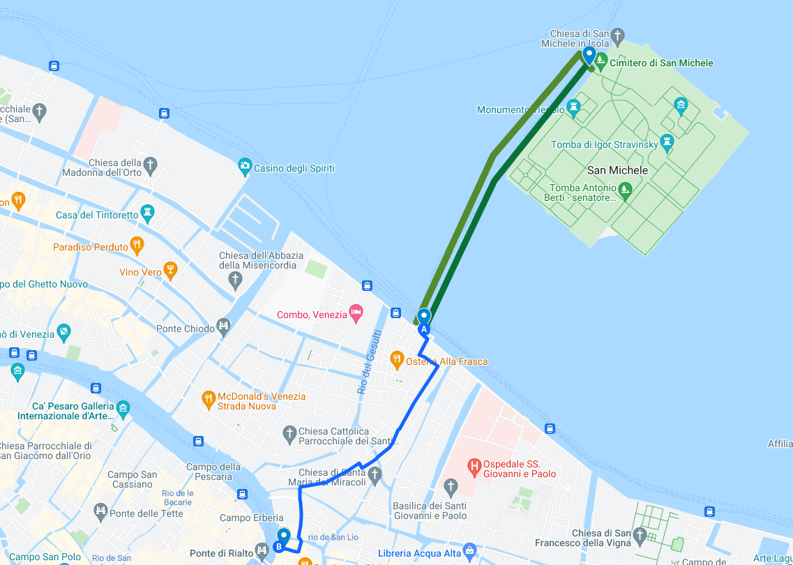

# Segundo Paseo: Cementerio y Fondaco dei Tedeschi

Este va a ser un paseo breve: el cementerio cierra a las 6, y además
ya hemos hablado del cementerio. Seguro que os acordáis: Napoleón,
salubridad, todo eso.

Los cementerios son siempre un sitio interesante. Por la tranquilidad,
por el arte, por ver qué hay escrito en las lápidas, descifrar las
últimas despedidas. Los que tienen vistas al mar son especialmente
paradójicos. Piensa uno, qué sitio tan bello para pasar la eternidad.

El de Venecia, habiendo sido cuna de tanto literato y artista diverso,
no es una excepción. Este cementerio, al ser el municipal, incluye
también tanto los enterramientos católicos, como los de otras
confesiones, o los de ninguna confesión. Todavía se sigue usando;
incluye tumbas de marinos británicos de la primera guerra mundial,
donde, recordemos, los italianos estuvieron con los aliados, igual por
la inquina que le tenían a los austrohúngaros, que dejaron de ser
austrohúngaros a consecuencia de la misma; también varias capillas, la
tumba del hijo de un emperador de México (sí, existe tal cosa), y la
de Helenio Herrera, conocido entrenador que ganó cuatro títulos de
liga en los años 50 con el Madrid y el Barcelona.

También contiene una historia de amor, un poco loca como lo son
todas, pero esta más de lo corriente, porque incluye a un poeta,
también locos de por sí, pero en este caso de ser un americano que
apoyó, hasta el punto de participar en emisiones radiofónicas
defendiéndolo, el fascismo y nazismo durante la segunda guerra
mundial. Ezra Pound es posiblemente uno de los mejores poetas del
siglo XX, y gracias a él se dieron a conocer autores como James
Joyce. Pero estaba zumbado. Y dentro de su estado general de locura,
mantenía una relación tanto con su esposa como con una amante, Olga
Rudge, que fue quien le cuidó hasta el fin de sus días. Que sobrevino
aquí precisamente, en Venecia, y por eso están enterrados los dos.

También está aquí enterrado Stravinsky, y el bailarín Diaghilev, este
último condenado por el régimen soviético, y cuyo mayor miedo era
morir en el agua. Sobre estar muerto rodeado de agua por todos lados
posiblemente no tenga ninguna objeción. Ni sobre eso ni sobre ninguna
otra cosa, una vez muerto.

También hay varias capillas: San Cristoforo, San Rocco, y San Michele; la primera y la última son los nombres de las islas que, en realidad, forman la única isla que hay hoy en día. San Michele tiene origen muy atrás, y antes de ser una capilla funeraria alojó a una comunidad de frailes camaldulenses, incluyendo a un tal Fra Mauro, que literalmente dibujó el primer mapamundi.

> Tuvo que ser, por supuesto, un veneciano quien dibujara, en 1459, el mapa más
> preciso del universo conocido. Habiendo navegado en los buques y peleado por
> la Serenísima, era el único estado que permitía a alguien alcanzar esa
> formación y obtener datos para dibujarlos.

Lo que tiene su mérito, porque todavía no había ni siquiera una imagen clara de
qué había en el mundo, antes de que Magallanes le diera la vuelta. San Michele
está construida con piedra de Istria, la que vimos por primera vez en el
aeropuerto, y es uno de los primeros ejemplos de arquitectura renacentista en
Italia. Al atardecer, vista desde el vaporetto, es una verdadera maravilla.

Pero vamos a ir a otro lugar para este atardecer: al Fondaco degli Tedeschi, o
de los alemanes; en realidad, se les llamaba alemanes a todo guiri que no fuera
de la parte de oriente (esos eran los *turchi*). Y ya hemos visto que un Fondaco
o Fondego (en veneciano) era un lugar que servía como alojamiento para
comerciantes extranjeros, pero también contenía oficinas, y almacenes. Hoy en
día es un centro comercial. Tampoco vamos a pararnos demasiado en el mismo:
vamos a la azotea.

La azotea es uno de esos miradores que no recibe mucha prensa, aunque tiene más
de 700 fotos en Google Photos; sin embargo
tiene una de las vistas más bonitas del atardecer, y a cualquier hora donde el
sol no de te directamente en la cara. A la izquierda tiene el puente de Rialto,
a la derecha el Cementerio, del que habremos venido en vaporetto, con cuidadín
antes de que lo cierren, pero también todo Canareggio. Dando la vuelta podemos
ver el resto de Venecia: San Marco, Dorsoduro, el Arsenal...

Pero también veremos una cosa curiosa: unos charnaques (término totalmente
ubetense) o a modo de terrazas erigidas sobre pilares en lo alto de los
tejados. No son terrazas en sí, porque no están en el techo; están construidas
por encima del techo y a ellas se accede... de alguna manera. Se trata de las
*altanas*, un curioso fenómeno veneciano que surgió no de forma moderna, sino en
siglos anteriores con el objeto, *wait for it*, de que las mujeres se tiñeran el
pelo al recibir el sol sobre la cabellera en la que habían untado un ungüento
llamado "agua juvenil", que contenía... orina de caballo.

